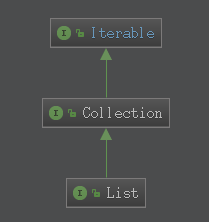

# 深入理解Java8
## lambda
>lambda就是用于表示匿名函数或者是闭包这样的一种运算符

lambada表达式的基本结构: 
```
(param1, param2, param3) -> {
    //执行体
}
```
* lambda表达式的完整语法是: (type1 arg1, type2 arg2) -> {body}
* 如果参数只有一个,并且类型可以推断,圆括号可以省略: arg -> {body}
* lambda主体可以包含零条或者多条语句
* 如果lambda表达式的主体只有一条语句,{}可以省略.匿名函数的赶回类型与主题表达式一致:s -> System.out.println(s).
* 如果lambda表达式的主体包含一条以上语句,表达式必须包含在{}中(形成代码块).匿名函数的返回类型与代码块的返回类型一致,若没有返回则为空.
 
[使用示例](../Test/src/JavaSE/lambda/Test1.java)
### 关于函数式接口
1. 如果一个结口只有一个抽象方法, 那么该接口就是函数式接口
2. 如果我们在某个接口上声明了 FunctionInterface 注解, 那么编译器就会按照函数式接口的定义来要求该接口.
3. 如果某个接口只有一个抽象方法, 但我们并没有对该接口声明FunctionInterface注解, 那么编译器依旧会将该接口看作函数式接口.
### 关于forEach()方法


集合中的forEach()方法是Iterable接口实现的.接口中定义了方法的实现称之为默认方法.
* 与for循环的区别:
    * for循环是**外部迭代**(即需要一个迭代器去对集合的元素进行迭代)
    * forEach()是**内部迭代**

## 函数式接口
* [function接口](src/java/util/function/Function.java)(理解function接口实际传入的是一种行为):[使用示例](../Test/src/JavaSE/lambda/FunctionTest.java)
* [comparator接口](src/java/util/Comparator.java):[使用示例](../Test/src/JavaSE/lambda/StringComparator.java)
### function的compose和addThen
function接口中除了apply方法还有两个default方法:
[compose和addThen方法使用示例](../Test/src/JavaSE/lambda/FunctionTest2.java)
1. function1.compose(function2).apply(value): 先执行function2的apply的方法,再执行function1的
2. function1.addThen(function2).apply(value): 先执行function1的apply的方法,再执行function1的 
